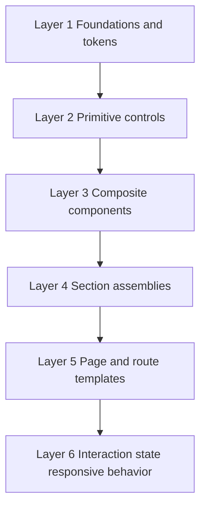

# Velarro Six-Layer Design System

Status: **Engineering working model pending explicit UI/UX confirmation**

Documented for M00.5 remediation. This is **not** a claim that the UI/UX team
approved an official Layer 1–6 taxonomy. The prior audit found no authoritative
six-layer definition in repository or Figma sources. This document records the
evidence-backed working model used by engineering until product design confirms
or replaces it.

Starting SHA reference: `00fbb317b3f10a762912170acd3de8e7386817aa`

## Dependency direction

Higher layers may consume lower layers. Lower layers must not import feature
pages, route modules, or higher-layer assemblies.



Text form:

```text
Foundations
  ↓
Primitives
  ↓
Composites
  ↓
Sections
  ↓
Page templates
  ↓
Routes and behavioral states
```

## Layer catalog

### Layer 1 — Foundations and design tokens

| Field | Content |
| --- | --- |
| Purpose | Shared visual constants: color, type roles, spacing, radius, shadow, overlays, focus, motion |
| Sources | `docs/figma/design-tokens.json`, `app/globals.css` (`:root` + `@theme`) |
| May depend on | Nothing application-specific |
| Must not depend on | Components, pages, routes |
| Figma | Token extraction; Figma-verified values labeled in CSS |
| Testing | Token contract tests (presence of critical variables) |
| Accessibility | Focus ring tokens; reduced-motion global rule |
| Responsive | Engineering breakpoints only until Figma verifies |
| Known gaps | Gotham / OneSignature fonts missing; limited Figma radii; some section overlays still local |

### Layer 2 — Primitive controls

| Field | Content |
| --- | --- |
| Purpose | Reusable interactive atoms |
| Sources | `components/ui/*` (Button, Input, Textarea, Checkbox, Radio, Switch, Accordion, Drawer, ProgressIndicator, RouteBackedModalShell, ImagePlaceholder) |
| May depend on | Layer 1 tokens, `lib/a11y`, `lib/cn` |
| Must not depend on | Module pages, route files |
| Figma | Shared control components in inventory |
| Testing | `tests/ui/*` including focus traps |
| Accessibility | Labels, keyboard, focus-visible, dialog semantics |
| Responsive | Prefer fluid width; avoid page-specific breakpoints |
| Known gaps | Not all Figma-named primitives implemented |

### Layer 3 — Composite components

| Field | Content |
| --- | --- |
| Purpose | Application chrome and multi-part controls reused across routes |
| Sources | `components/layout/main-navbar.tsx`, `main-footer.tsx`, `main-menu-sidebar.tsx`, shells (`site-shell`, `container`, `section`) |
| May depend on | Layers 1–2, approved assets helpers |
| Must not depend on | `app/**` pages or `components/m0x-*` page modules |
| Figma | MAIN NAVBAR `14279:30062` / instance `14406:85640`; footer `14468:34842`; menu `14351:51937` |
| Testing | Navbar/footer/menu unit tests; keyboard/drawer behavior |
| Accessibility | Landmarks, deferred control honesty, focus lock on menu |
| Responsive | Sticky header; drawer for explore menu |
| Known gaps | Search/cart/login deferred; newsletter deferred |

### Layer 4 — Section assemblies

| Field | Content |
| --- | --- |
| Purpose | Page sections with editorial layout (heroes, carousels, grids) |
| Sources | `components/m0x-*` section components |
| May depend on | Layers 1–3 |
| Must not depend on | Sibling module pages or route files |
| Figma | Section nodes in module inventories |
| Testing | Section unit tests |
| Accessibility | Heading hierarchy, alt text, carousel controls |
| Responsive | Derived until Figma mobile frames exist |
| Known gaps | Many deferred assets; hardcoded overlays remain in places |

### Layer 5 — Page and route templates

| Field | Content |
| --- | --- |
| Purpose | Full-page composition and age/review shells |
| Sources | `app/**/page.tsx`, `*-page-by-age-state.tsx`, `*-page.tsx` |
| May depend on | Layers 1–4, `lib/age`, `lib/seo` |
| Must not depend on | Cross-importing unrelated module internals without need |
| Figma | Screen manifest frames |
| Testing | Age-state page tests; route manifest/SEO tests |
| Accessibility | Landmarks; skip patterns via shell |
| Responsive | Desktop 1440 first |
| Known gaps | Homepage pixel fidelity deferred to next batch |

### Layer 6 — Interaction, state, responsive, and behavioral rules

| Field | Content |
| --- | --- |
| Purpose | Age gate, forms, loading/error/not-found, overflow rules, honesty of deferred UI |
| Sources | `components/age/*`, form modules, `app/not-found.tsx`, `app/error.tsx`, route access |
| May depend on | All lower layers |
| Must not | Fabricate backend success or legal authorization from cookies alone |
| Figma | Prototype flow map; many interactions unspecified |
| Testing | Form honesty tests; E2E M09; security headers |
| Accessibility | Live regions, error association, focus restoration |
| Responsive | No document-level horizontal overflow; bounded scroll regions OK |
| Known gaps | No backends; CSP unsafe-inline; commerce deferred |

## Ownership rules (M00.5)

- Global chrome (navbar, footer, explore menu) lives under `components/layout/`.
- Homepage module `components/m01-home/` owns homepage sections only, not global shell.
- Tokens are introduced only from Figma extraction or documented repeated approved values.
