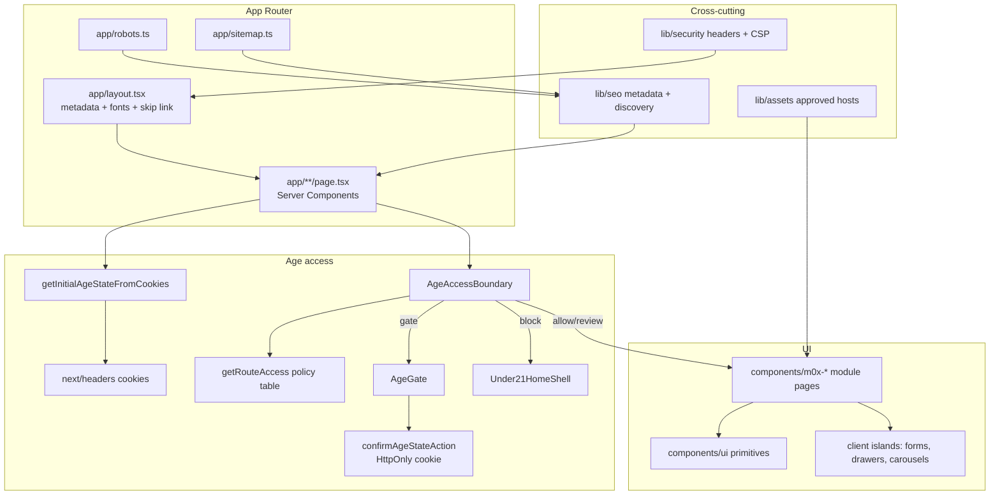
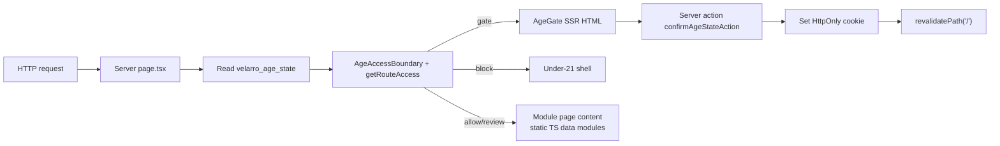
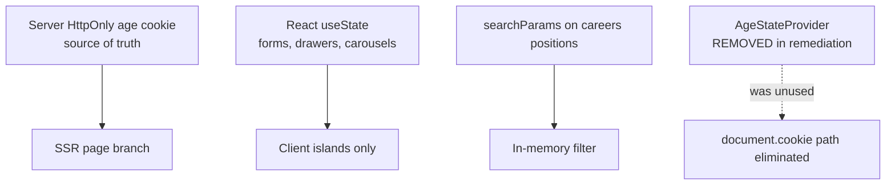
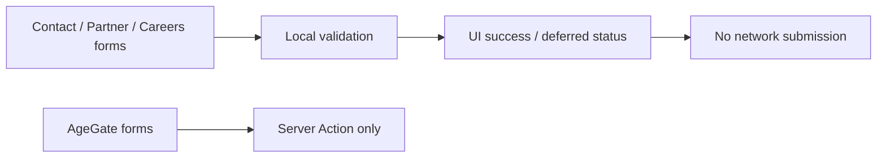
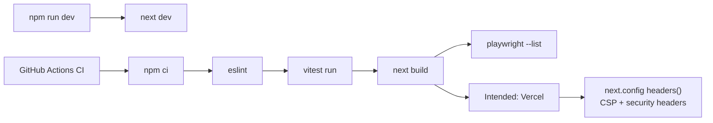

# Frontend Architecture

Evidence-backed architecture of `velarro-web-frontend` as of the 2026-07-15 forensic audit.

## High-level modules



## Route to data flow



There is **no** runtime `fetch`/axios product API layer. Catalog, careers, and editorial copy are static TypeScript modules.

Middleware is intentionally deferred until protected API/commerce mutations exist; UI age presentation is centralized via `AgeAccessBoundary`.


## State ownership



## API request path



## Authentication path

Not implemented. Manifest lists `/login`, `/signup`, password reset as `implemented: false`. Navbar Login control is disabled/deferred.

## Cart / checkout flow

Not implemented. Manifest lists `/cart` and `/checkout/*` as planned. No payment SDKs, cart persistence, or price authority on the client.

## Build and deployment path



## Folder structure (actual)

```text
app/                 App Router pages, layout, robots, sitemap
components/
  age/               Age gate UI
  layout/            M00 shell primitives (lightly used vs module navbars)
  m01-home/ … m09-*/ Module feature UI
  ui/                Shared primitives
lib/
  a11y/ age/ assets/ security/ seo/ m01-home/
tests/               Vitest + Playwright mirroring modules
docs/                Figma + implementation + audits
```

This intentionally diverges from the attached standards’ `src/components/common/services/store` tutorial tree.
