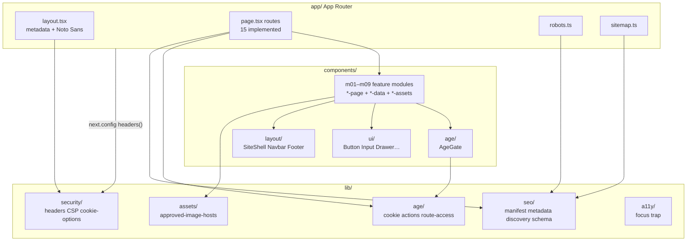
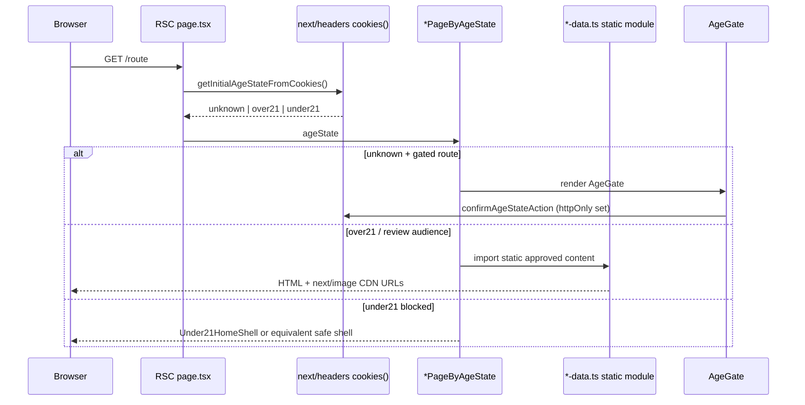
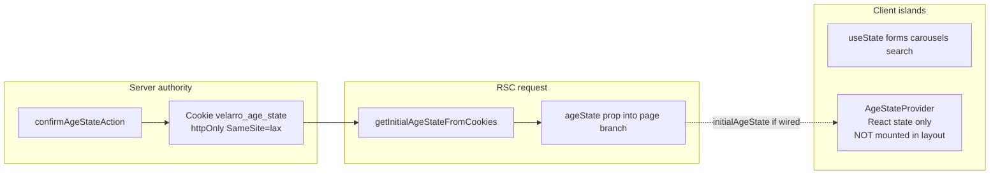
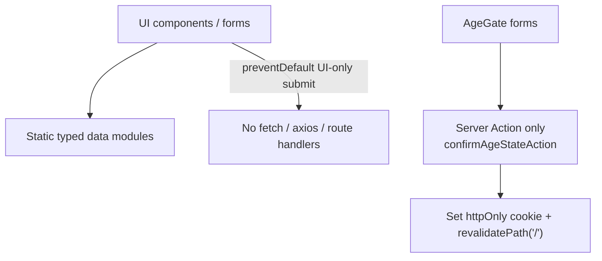
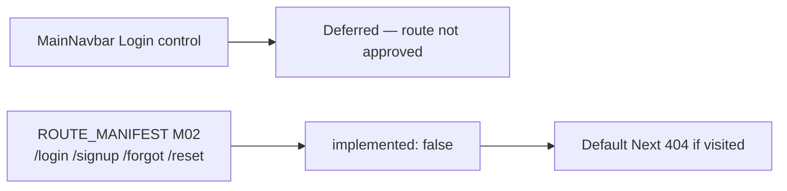
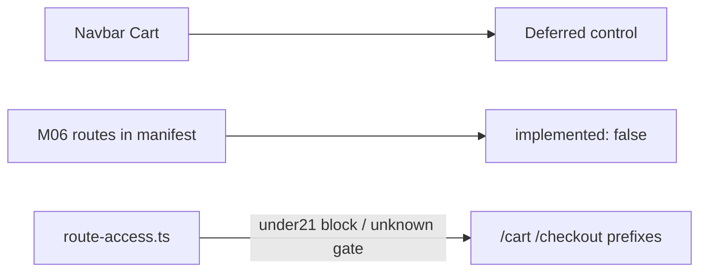
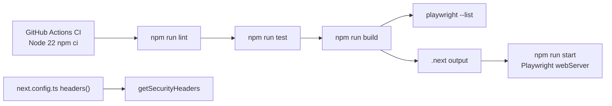

# Frontend Architecture

Generated: 2026-07-15 · Evidence-only relationships from the current codebase.

## High-level module architecture

## Route-to-data flow

## State ownership

## API request path

**Verified:** Zero `fetch(`/`axios`/`XMLHttpRequest` call sites in `app/`, `components/`, `lib/`.

## Authentication path

No session tokens, no auth cookies, no protected API calls.

## Cart / checkout flow

No cart state, pricing math, payment SDK, or order APIs exist.

## Build and deployment path

Hosting provider is not pinned in-repo (no `vercel.json`). Production HSTS requires `VELARRO_ENABLE_HSTS=true`.
